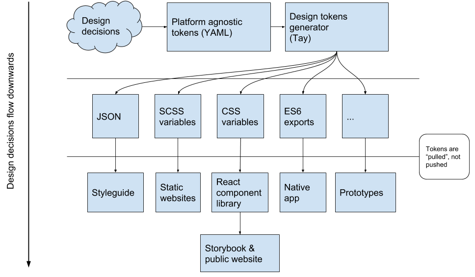

# tay

Compiles YAML design tokens into usable project variables.

## Workflow



## Installation

```
$ npm install --save tay
```

## Usage

Add to npm `package.json`:

```
"scripts": {
	"tay": "tay --input tokens.yaml --output public/styles/tokens.css"
}
```

Then `npm run tay`. Additionally, if you use `npm start`/`npm build`:

```
"scripts": {
	"prestart": "npm run tay",
	"prebuild": "npm run tay"
}
```

`tay` will then run when you start or build the project.

## Available formatters

Tokens can be output in the following formats:

* CSS custom properties
* Sass variables
* JS exports
* Flat JSON
* JSON

## CLI options

```
-v, --version              output the version number
-i, --input <inputFile>    Input YAML file
-o, --output <outputFile>  Output file
-w, --watch                Watch input for changes
-h, --help                 output usage information
```

## Running the tests

### Unit

Unit tests are built using Jest for each output formatter.

```
$ npm test
```

### Coding style

Code style is checked using ESLint/Prettier.

```
$ npm run lint
```

## Versioning

Tay uses [semver](http://semver.org/) for versioning. For the versions available, see the [tags on this repository](https://github.com/dan1elhughes/tay/tags).

## Authors

Maintained by [@dan1elhughes](https://github.com/dan1elhughes).

See also the list of [contributors](https://github.com/dan1elhughes/tay/contributors) who participated in this project.

## License

This project is licensed under the MIT License - see the [LICENSE.md](LICENSE.md) file for details
